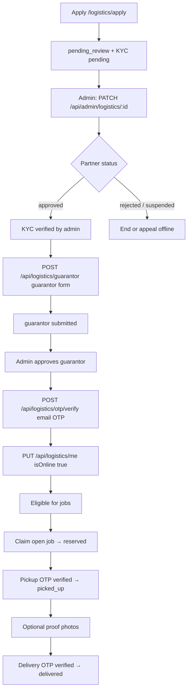

# Taja logistics: partner flow, verification, and admin operations

This document describes how the in-app logistics partner program is **intended to work** in the current codebase: onboarding, verification, job lifecycle, what partners receive (limits and gates), admin tools, and **how admins are alerted** (in-app notifications + email).

---

## 1. Roles

| Role | Responsibility |
|------|----------------|
| **Logistics partner (rider / carrier)** | Applies, completes KYC and guarantor steps, verifies email, goes online, claims delivery jobs, uploads proof, verifies pickup/delivery OTPs with seller/buyer. |
| **Admin** | Reviews applications and guarantor forms, adjusts trust tier and assignment limits, creates delivery job broadcasts from orders, reopens jobs to the queue if needed, audits events. |
| **Seller / buyer** | Interact with orders and tracking; pickup/delivery OTPs are part of the handoff (codes are issued when a job is broadcast—see admin broadcast response; do not leak via insecure channels). |

---

## 2. Partner journey (high level)

---

## 3. Onboarding and data collection

### 3.1 Application (`POST /api/logistics/apply`)

- **Public endpoint** (optional auth): submits or updates a **LogisticsPartner** record keyed by **email + phone**.
- **Required fields**: full name, email, phone, vehicle type (preset: `bicycle`, `motorcycle`, `car`, `van`, `truck`, or custom 2–80 chars), state, city; **selfie + ID front** URLs (soft KYC).
- **On success**: profile is upserted with `status: "pending_review"`, `trust.kycStatus: "pending"`, guarantor form `not_submitted`, payout hold fields set (defaults include a **payout hold window**—see model / apply route), assignment counters at zero, and default **assignment limits** (e.g. max order value, radius, concurrent jobs—see `LogisticsPartner` schema and apply `$set`).

### 3.2 Linking to a user account

- If the request is authenticated, `user` on the partner document can be linked to the logged-in user for dashboard flows (`/logistics/dashboard`, `/api/logistics/me`).

### 3.3 KYC images

- Uploads use **`POST /api/upload`** with `type=logistics-kyc` (see upload route). Store returned URLs in the application payload.

---

## 4. How you should verify (operations checklist)

Use **Admin → Logistics** (`/admin/logistics`) as the control room.

1. **Application queue**  
   - Filter `pending_review`.  
   - Open **selfie** and **ID front**; check name vs ID, document quality, obvious fraud signals.

2. **Identity and risk**  
   - Use `PATCH /api/admin/logistics/:id` to set:
     - `status`: `approved` | `rejected` | `suspended` | `pending_review`
     - `kycStatus` under trust: `pending` | `verified` | `rejected`
     - Optional: `trustTier` (0–3), `maxOrderValueKobo`, `maxRadiusKm`, `maxConcurrentJobs`
     - Risk: `risk.level`, optional `reasonCode` / notes  
   - Reject or suspend if unsure; **blacklist** or **suspend** forces **offline** in code.

3. **Guarantor** (after partner is **approved** and **KYC verified**)  
   - Partner submits `POST /api/logistics/guarantor` with guarantor identity + images.  
   - Admin reviews guarantor block in UI and sets `guarantorFormStatus` to `approved` or `rejected` via PATCH.  
   - If guarantor is not **approved**, partner **cannot** go online (see `/api/logistics/me` PUT).

4. **Email verification**  
   - Partner completes logistics **email OTP** (`/api/logistics/otp/send` + `/api/logistics/otp/verify`).  
   - `GET /api/logistics/me` exposes `emailOtpVerified` and `eligibleForAssignment`—use these in support.

5. **Going online**  
   - `PUT /api/logistics/me` with `isOnline: true` only allowed when: `status === approved`, KYC **verified**, guarantor **approved**, not blacklisted.

6. **Jobs**  
   - Admin **broadcasts** a job from an order.  
   - Eligible partners in matching **pickup city/state** (and under value cap) can **claim**.  
   - Audit **DeliveryEvent** timeline (admin UI / `GET .../events` if used).

7. **Completion**  
   - **Pickup OTP** → status `picked_up`.  
   - **Delivery OTP** → status `delivered`.  
   - Review **proof** photos if disputes arise.

---

## 5. What partners get (capabilities and constraints)

| Item | Meaning in code |
|------|-------------------|
| **Status** | `approved` required for guarantor step and going online. |
| **KYC** | Admin must set `trust.kycStatus` to `verified` for full pipeline. |
| **Guarantor** | Must be `approved` to go online and claim jobs. |
| **Email OTP** | Must be verified for `eligibleForAssignment` in `GET /api/logistics/me`. |
| **Assignment limits** | `maxOrderValueKobo`, `maxRadiusKm`, `maxConcurrentJobs` cap exposure (defaults set on apply; admin can raise within PATCH validation). |
| **Payout hold** | `payout.holdDays` / `holdUntil` modelled on apply—ops/finance should align real payouts with this. |
| **Jobs** | `GET /api/logistics/jobs/nearby` (open jobs), `GET /api/logistics/jobs/mine` (active), claim / proof / OTP routes on `DeliveryJob`. |

Exact numeric defaults are defined in **`src/app/api/logistics/apply/route.ts`** and **`src/models/LogisticsPartner.ts`**—treat those as source of truth when writing policy for riders.

---

## 6. Delivery job lifecycle (technical)

| Status | Typical next step |
|--------|-------------------|
| `open` | First eligible rider `POST .../claim` → `reserved` (claim window enforced). |
| `reserved` | Rider verifies **pickup OTP** → `picked_up`. |
| `picked_up` | Optional proof uploads; then **delivery OTP** → `delivered`. |
| `delivered` / `cancelled` / `disputed` | Terminal-ish states for dispatch; align with order/escrow processes separately. |

- **Broadcast**: `POST /api/admin/logistics/jobs/broadcast` creates `DeliveryJob` + OTP hashes; **plaintext OTPs are returned once in the JSON response** for admin to share securely with seller/buyer—**do not** put them in email bodies.
- **Reassign**: `POST /api/admin/logistics/jobs/:id/reassign` releases rider and sets job back to `open` with a new expiry.

---

## 7. Admin UI and APIs (quick reference)

| Area | Path |
|------|------|
| Admin logistics hub | `/admin/logistics` |
| List / filter partners | `GET /api/admin/logistics` (see admin page) |
| Review partner | `PATCH /api/admin/logistics/:id` |
| Create broadcast job | `POST /api/admin/logistics/jobs/broadcast` |
| List jobs | `GET /api/admin/logistics/jobs` |
| Reassign job | `POST /api/admin/logistics/jobs/:id/reassign` |
| Job events / timeline | `GET /api/admin/logistics/jobs/:id/events` (if enabled in UI) |

Partner-facing:

| Area | Path |
|------|------|
| Apply form | `/logistics/apply` |
| Partner dashboard | `/logistics/dashboard` |
| Profile + online toggle | `GET` / `PUT /api/logistics/me` |
| Guarantor | `POST /api/logistics/guarantor` |
| Jobs | `GET .../jobs/nearby`, `GET .../jobs/mine`, `POST .../jobs/:id/claim`, proof + OTP verify |

---

## 8. Admin notifications and email (implemented)

All **`role: admin`** users receive:

1. **In-app notification** (`type: "system"`, metadata `channel: "logistics"`) with link to **`/admin/logistics`**.
2. **Email** (if outbound mail is configured—same stack as the rest of the app: **`deliverHtmlMail`** in `src/lib/mail-delivery.ts`; set `RESEND_API_KEY` and/or SMTP env vars).

| Event | When it fires |
|-------|----------------|
| New logistics application | After successful `POST /api/logistics/apply` |
| Guarantor form submitted | After successful `POST /api/logistics/guarantor` |
| Delivery job broadcast created | After `POST /api/admin/logistics/jobs/broadcast` (no OTP in email) |
| Job claimed | After successful `POST /api/logistics/jobs/:id/claim` |
| Pickup / delivery proof uploaded | After `POST /api/logistics/jobs/:id/proof` |
| Job released back to queue | After `POST /api/admin/logistics/jobs/:id/reassign` |
| Pickup or delivery OTP verified on job | After `POST /api/logistics/jobs/:id/otp/verify` |
| Partner verified logistics email (OTP) | After `POST /api/logistics/otp/verify` |
| Admin changed key review fields | After `PATCH /api/admin/logistics/:id` when status, KYC, guarantor review, risk level, or trust tier **actually changes** |

Implementation entry point: **`src/lib/logisticsAdminNotify.ts`**.

---

## 9. Environment and reliability

- **Email**: Without `RESEND_API_KEY` or SMTP, **in-app notifications still fire**; emails are skipped with a console warning.
- **Base URL for links**: `FRONTEND_URL` or `NEXTAUTH_URL` (fallback `https://tajaapp.shop`) is used in notification links and email buttons.

---

## 10. Suggested ops policy (outside code)

- Define SLAs for **application review** and **guarantor review**.  
- Define how OTPs are communicated to seller/buyer (call, in-app chat, masked SMS—**not** public channels).  
- Align **payouts** and **insurance** with `payout` and `assignment` fields in the database.  
- Keep an internal runbook for **disputed** or **cancelled** jobs linked to orders.

---

## 11. Related files (for engineers)

- Model: `src/models/LogisticsPartner.ts`, `src/models/DeliveryJob.ts`, `src/models/DeliveryEvent.ts`  
- Admin notify: `src/lib/logisticsAdminNotify.ts`  
- Notifications core: `src/lib/notifications.ts`  
- Mail: `src/lib/mail-delivery.ts`  
- Job rules helper: `src/lib/jobs/deliveryJobs.ts`  

This document reflects the **current implementation**; adjust it when behaviour or defaults change.
