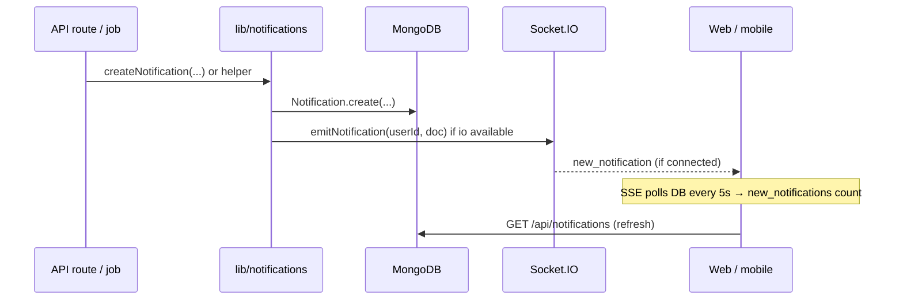

# Notifications: behavior, endpoints, flow, and web UI (mobile parity)

This document describes how in-app notifications work in Taja: persistence, HTTP APIs, real-time channels, server-side creation, and how the web UI presents them so React Native (or other mobile clients) can mirror behavior.

---

## 1. Data model

Notifications are stored in MongoDB (`Notification` model). Each document belongs to one user and includes:

| Field | Notes |
|--------|--------|
| `user` | ObjectId ref to User (indexed) |
| `type` | `order` \| `message` \| `review` \| `payment` \| `system` \| `promotion` \| `chat` \| `shop` |
| `title`, `message` | Required strings |
| `link` | Optional in-app path (e.g. `/dashboard/orders/...`) |
| `actionUrl` | Optional full URL or path (admins often get absolute URLs) |
| `read` | Boolean, default `false` (indexed with `user`) |
| `priority` | `low` \| `normal` \| `high` \| `urgent` (default `normal`) |
| `imageUrl` | Optional |
| `metadata` | Arbitrary JSON (events like `profile_view`, `product_like`, ticket ids, etc.) |
| `createdAt`, `updatedAt` | From Mongoose timestamps |

---

## 2. HTTP endpoints (mobile consumption)

All routes require authentication: **`Authorization: Bearer <jwt>`** (case-insensitive `Bearer`) or the **`token` cookie** (browser parity). On failure, expect JSON such as `{ success: false, message: "..." }` with **401**.

### `GET /api/notifications`

Returns a paginated list plus a global unread count.

**Query parameters**

| Param | Description |
|--------|-------------|
| `page` | Default `1` |
| `limit` | Default `20` (web hook often uses `50`) |
| `unread` | If `true`, only unread rows (`read: false`) |
| `type` | Filter by notification `type` |

**Important:** Use `unread=true` for unread-only lists. There is **no** `status=unread` parameter in the handler; unknown params are ignored.

**Response (`200`)**

```json
{
  "success": true,
  "data": {
    "notifications": [ /* lean documents */ ],
    "pagination": {
      "page": 1,
      "limit": 20,
      "total": 42,
      "pages": 3
    },
    "unreadCount": 5
  }
}
```

- `pagination.total` applies to the **current filtered query** (e.g. unread-only if `unread=true`).
- `unreadCount` is always the count of **unread** notifications for the user (even when not filtering by unread).

### `PUT /api/notifications/[id]`

Body: `{ "read": true }` or `{ "read": false }`. Updates one notification if it belongs to the current user.

### `DELETE /api/notifications/[id]`

Deletes one notification for the current user.

### `PUT /api/notifications/mark-all-read`

Marks **all** unread notifications as read for the current user.

Response includes `data.updatedCount` (Mongo `modifiedCount`).

### `DELETE /api/notifications/clear-all`

Deletes **all** notifications for the current user.

Response includes `data.deletedCount`.

### `POST /api/notifications`

Creates a notification. Body may include `userId` (defaults to caller), `type`, `title`, `message`, optional `link`, `actionUrl`, `priority`, `imageUrl`, `metadata`. Intended for admin/system use; same auth rules apply.

---

## 3. Real-time and “live” updates

Three mechanisms exist on the web client; mobile should pick what fits the stack.

### A. Server-Sent Events — `GET /api/notifications/stream`

- **Content-Type:** `text/event-stream`
- **Behavior:** On connect, sends `data: {"type":"connected"}`.
- Every **5 seconds**, the server looks for notifications with `createdAt` **newer** than the last seen batch and:
  - If any: emits `data: {"type":"new_notifications","count":<n>}` and advances the cursor to the newest `createdAt`.
  - Else: sends a comment line `: heartbeat` to keep the connection alive.

**Auth note:** The handler uses the same token extraction as other routes (`Bearer` **or** `token` cookie). The browser **`EventSource` API does not send custom headers**, so in practice the **cookie** path is what makes SSE work in standard browsers when the JWT lives only in `localStorage`. Mobile apps using **Bearer-only** should not rely on browser `EventSource` behavior; use **polling** (see below) or a fetch-based SSE client that attaches `Authorization`.

### B. Socket.IO

- Clients connect with **`auth: { token: <jwt> }`** (and/or `Authorization` header in handshake as implemented in `socket.ts`).
- On connect, the socket joins room `user_<userId>`.
- When a notification is created server-side and Socket.IO is available, the server can emit **`new_notification`** to that room with the notification payload.
- Optional client event: **`mark_notifications_read`** → server marks all unread DB rows for the user and emits **`notifications_marked_read`** (duplicates REST “mark all read”).

### C. Polling (web fallback)

`useNotifications` also **refetches every 30 seconds** regardless of SSE/socket. Mobile can mirror this interval or tune it (e.g. 15–60 s) when foregrounded.

---

## 4. End-to-end flow (how a notification is born)



1. **Business logic** (orders, payments, shops, support, KYC, product views, etc.) calls **`createNotification`** or a helper in `src/lib/notifications.ts`.
2. A row is inserted with `read: false`.
3. **Best-effort** Socket.IO push to `user_<userId>` (`new_notification`).
4. **SSE** (and polling) eventually notice new rows and trigger a **full list refresh** on the web (payload is count-only for SSE, not the full document).

Helpers include (non-exhaustive): `notifyOrderUpdate`, `notifyPaymentUpdate`, `notifyDeliveryUpdate`, `notifyNewMessage`, `notifyAdminsNewOrder`, `notifyAdminsPaymentReceived`, `notifyAdminsNewShop`, support ticket helpers, `notifyOwnerViewAlert`, `notifySellerProductLiked`, etc.

---

## 5. Web UI behavior (parity checklist for mobile)

### Full page: `/notifications` (`src/app/notifications/page.tsx`)

- **Header:** Title “My Alerts”, subtitle, back link to seller dashboard, **unread badge** on bell icon.
- **Actions:** “Delete All” (clears all via `DELETE /api/notifications/clear-all`), **Mark all as read** when `unreadCount > 0`.
- **Filters:** Tabs **All** vs **Unread** (client-side filter on loaded list).
- **Grouping:** **Today**, **Yesterday**, **Earlier this week**, **Older** (by `createdAt`).
- **Row UI:**
  - Colored **icon** by `type` (and urgency styling for `system` + `urgent`).
  - **Title**, **message** (line-clamped), **relative time** (`timeAgo`).
  - Unread: tinted background, “New Alert” pill; **Urgent** pill when `priority === "urgent"`.
  - **Click:** `markAsRead` if unread, then navigate to `link || actionUrl` via Next router.
  - Hover actions: mark read, delete single item.
- **Empty states** for no notifications vs no unread.
- **Note:** “Show More History” appears when `length >= 50` but pagination is not wired in this page (initial fetch is `limit=50`).

### Modal: `NotificationsModal` (dashboard / admin layouts)

- Same hook: `useNotifications`.
- **Seller path rewrite:** If `user.role === "seller"` and target is buyer dashboard orders (`/dashboard/orders`…), rewrite to **`/seller/orders`…** for both path and absolute URLs (hostname parsed). Mobile should apply the same rule when mapping web paths to native routes.
- Filters **All / Unread**, list with icons by type, mark one read, delete one, mark all read; does **not** expose “clear all” in the same way as the full page (verify current component for parity).

### Header bell (`AppHeader`)

- Loads unread-related state and subscribes to SSE; on `new_notifications`, increments count and shows a **toast**.
- For **correct** unread totals from the API, consume **`data.unreadCount`** from `GET /api/notifications` (optionally with `limit=1` to minimize payload), not a nonexistent `status` query.

### Browser push

`useNotifications` may call **`Notification.requestPermission()`** for the **Web Notifications API** (system permission). That is separate from in-app MongoDB notifications.

---

## 6. Client helper (`src/lib/api.ts`)

`notificationsApi` wraps the same routes:

- `getNotifications({ page, limit, unread, type })`
- `markAsRead(id)`, `markAllAsRead()`, `deleteNotification(id)`
- `createNotification(data)` → `POST /api/notifications`

---

## 7. Mobile implementation notes

1. **List + badge:** Use `GET /api/notifications` with Bearer; display `unreadCount` for tab badges and toolbar icons.
2. **Refresh strategy:** Combine **foreground polling** (e.g. 30 s) with **Socket.IO** `new_notification` if you already use the same socket server; treat SSE as optional if you implement a fetch/SSE client with Bearer.
3. **Deep links:** Prefer **`link`** first, then **`actionUrl`**. Normalize absolute URLs (strip origin) or map path prefixes to mobile screens; apply **seller order path** rewrite like `NotificationsModal`.
4. **Types & priority:** Mirror web chips for unread/urgent and icon mapping by `type`.
5. **Mark read:** On tap, call `PUT .../id` with `{ read: true }` before navigation (same as web).
6. **No FCM in this doc:** Push notifications (FCM/APNs) are not defined here; this covers **in-app** notification records and existing transport.

---

## 8. OpenAPI

Route summaries also appear under the **Notifications** tag in `src/openapi/openapi.json` for schema reference.
