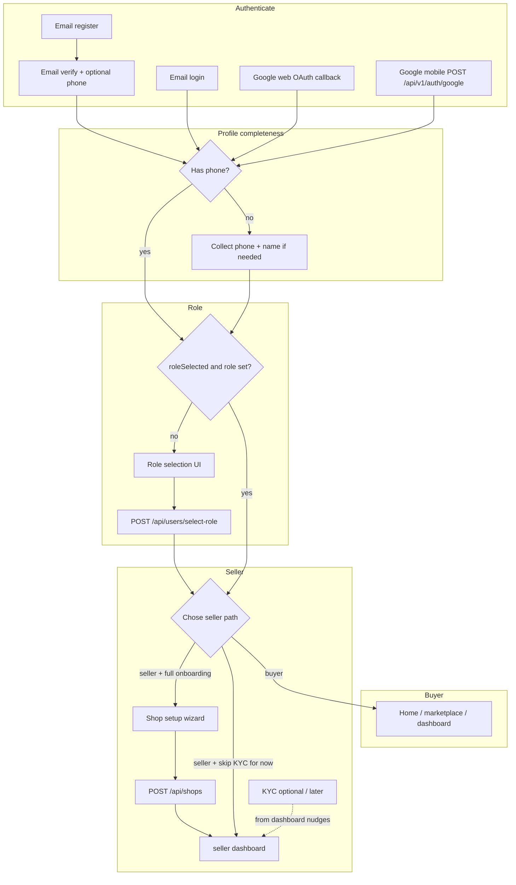

# Taja — Web onboarding & roles → mobile parity spec

This document describes **exactly how the Next.js web app** handles auth, onboarding, role selection, seller shop setup, and KYC **after signup**, including **which API endpoints are called** and **routing rules**. Use it to build the **same flow in React Native** (different UI only).

**Important:** In the current codebase there is **no “age” field** and no separate “numbers” screen beyond **phone number** (Nigerian format). OAuth onboarding collects **full name + phone** on `/onboarding`. Email/password signup collects **phone after email verify** (or on `/onboarding` if the user came from OAuth without phone).

---

## 1. Concepts the server stores (for routing)

| Flag / field | Meaning |
|--------------|---------|
| `user.phone` | Non-empty → “has phone” |
| `user.role` | `"buyer"` \| `"seller"` \| `"admin"` |
| `user.roleSelected` | `true` after user has **confirmed** role via register, Google mobile body, or `select-role` |
| `user.kyc.status` | `"not_started"` \| `"pending"` \| `"approved"` \| `"rejected"` |
| Shop document | `GET /api/shops/my` returns a shop if user already created one |

Mobile should **`GET /api/users/me`** (Bearer token) after any auth success to decide which screen to show.

---

## 2. High-level flowchart (all channels)



---

## 3. Channel-specific: what the web does

### 3.1 Email / password **register** (`POST /api/auth/register`)

- Body includes `fullName`, `email`, `password`, `role` (`buyer` | `seller`).
- Server sets **`roleSelected: true`** and **`role`** immediately.
- **No phone** at register (optional on API; web UI omits it).

**Next web screen:** verify email (`/verify-email?email=…`).

### 3.2 Email **verify** (`POST /api/auth/verify-email`)

- Body: `{ email, code }`.
- Response includes **`token`**, **`refreshToken`**, **`user`** (same as login).
- If `user` has **no phone**, web shows a **second step** on the same screen: collect phone → **`PUT /api/auth/profile`** with `{ phone }` (Bearer).
- Then navigate to `redirect` query param or **`/dashboard`**.

**Result:** User already has **`role` + `roleSelected`** → web **does not** send them to `/onboarding` or `/onboarding/role-selection` for normal email signup.

### 3.3 Email **login** (`POST /api/auth/login`)

- Store tokens; load user (e.g. `GET /api/users/me`).
- Middleware on web uses **cookie**; mobile uses **Bearer only** (no cookie required).

### 3.4 Google **web** OAuth (browser redirect)

After `/auth/callback` loads tokens and fetches profile:

- If **no phone** OR profile not considered complete (`auth/callback` logic: missing `roleSelected` / phone):  
  → **`/onboarding?redirect=<original>`**
- **`/onboarding`** (“Let’s get to know you”):
  - Fields: **full name**, **phone** (Nigerian validation).
  - **`PUT /api/users/me`** with `{ fullName, phone }`.
  - Then **`/onboarding/role-selection?redirect=…`**

### 3.5 Google **mobile** (`POST /api/v1/auth/google`)

- Body: `{ idToken, role?: "buyer" | "seller" }`.
- If `role` sent for a **new** user, server sets **`roleSelected: true`** (same idea as email register).
- **Phone** may still be missing → mobile should mirror **either** verify-email phone step **or** the **`/onboarding` screen** (name + phone + `PUT /api/users/me`).

**Rule:** After any Google sign-in, call **`GET /api/users/me`** and branch:

- No phone → onboarding profile screen (see §4).
- Phone but OAuth-style user without `roleSelected` → role selection.
- `roleSelected` + `role` → go straight to buyer or seller home (see below).

---

## 4. Screen A — “Onboarding profile” (web: `/onboarding`)

**When:** User is authenticated but **missing phone** (and often needs name confirmation). Typical for **Google web**; mobile should use the same gate.

**UI copy (web reference):** “Let’s get to know you” — full name, phone (for orders & security).

**Endpoint**

```http
PUT /api/users/me
Authorization: Bearer <accessToken>
Content-Type: application/json

{
  "fullName": "Chinedu Okeke",
  "phone": "08012345678"
}
```

- Normalize phone like web (`normalizeNigerianPhone` / validate Nigerian format).
- Then **`GET /api/users/me`** or existing `refreshUser()` to refresh local state.

**Next screen:** **Role selection** (§5), passing through the same **`redirect`** intent (e.g. deep link target).

**Skip condition:** `user.phone` present **and** you already decided role elsewhere (`roleSelected`).

---

## 5. Screen B — “Role selection” (web: `/onboarding/role-selection`)

**When:**

- User has **phone** (and name), but **`roleSelected`** is false **or** you need explicit role pick (OAuth path).
- Web **skips** this if `user.roleSelected && user.role` (e.g. email register).

**Buyer card**

- On choose: **`POST /api/users/select-role`** `{ "role": "buyer" }`.
- On success: `refreshUser` → navigate to **`redirect`** or **`/dashboard`**.

**Seller — two actions**

1. **“Launch Your Shop”** (full path):  
   - `POST /api/users/select-role` `{ "role": "seller" }`  
   - Navigate to **shop setup** (§6), e.g. web `/seller/setup`.

2. **“Skip for now — explore the platform”**:  
   - Same API: `{ "role": "seller" }` (still sets seller role on server).  
   - Web navigates to **`/seller/dashboard`** **without** shop setup (KYC/shop nudges happen later in seller shell).

**Endpoint**

```http
POST /api/users/select-role
Authorization: Bearer <accessToken>
Content-Type: application/json

{ "role": "buyer" }
```

or

```json
{ "role": "seller" }
```

**Response:** `{ success, message, data: { role, roleSelected } }`.

**Server side-note:** Choosing `seller` initializes `kyc.status` to `not_started` if empty.

---

## 6. Screen C — Seller shop setup (web: `/seller/setup`)

**When:** New seller chose **Launch Your Shop**.

**Preflight**

```http
GET /api/shops/my
Authorization: Bearer <accessToken>
```

- If shop exists → web shows toast and **`/seller/dashboard`** (one shop per user).

**Wizard (3 steps on web)**

1. **Shop info:** name, slug (auto from name), description, categories (multi-select), optional AI helpers:
   - `POST /api/ai/shop-suggestions` — optional.
2. **Business:** business type, name, address.
3. **Settings:** response time, return policy; social links.

**Submit**

```http
POST /api/shops
Authorization: Bearer <accessToken>
Content-Type: application/json
```

Body: same structure as web `formData` (shopName, shopSlug, description, categories, businessInfo, socialLinks, settings, …). The API persists core shop fields (`shopName`, `shopSlug`, `description`, `socialLinks`, `settings`, etc.); **mirror the web payload** to avoid drift.

**Success:** `201`, message about under review → **seller dashboard**.

**Errors:** `409` if shop already exists; `400` if slug taken.

---

## 7. Screen D — KYC / verification (web: `/onboarding/kyc` and `/seller/verification`)

**When:** Seller needs identity/bank verification; web **nudges** from seller layout when KYC pending.

**Submit**

```http
POST /api/users/kyc/submit
Authorization: Bearer <accessToken>
Content-Type: application/json
```

Body (required fields per API): `businessName`, `idType`, `idNumber`, `bankName`, `accountNumber`, `accountName`, optional `businessType`, `businessRegistrationNumber`, `bankVerificationNumber`, optional `verifyIdentity`.

**After submit:** `kyc.status` → `pending`; admins review.

**Mobile:** Multi-step UI (Business → Identity → Banking) like web; same endpoint.

---

## 8. Buyer capabilities (after onboarding)

Once **`role === buyer`** (or user is effectively shopping):

| Intent | Typical endpoint |
|--------|------------------|
| Home / feed | `GET /api/marketplace/feed` |
| Products | `GET /api/products`, `GET /api/products/slug/:slug` |
| Cart | `GET/POST /api/cart` |
| Checkout / orders | `POST /api/orders`, `GET /api/orders`, `GET /api/orders/:id` |
| Addresses | `GET/POST /api/users/addresses` |
| Profile | `GET/PUT /api/users/me` |
| Wishlist | `GET/POST/DELETE /api/wishlist` |
| Wallet | `GET /api/wallet/balance`, etc. |

Use **`Authorization: Bearer`** on all authenticated routes.

---

## 9. Seller capabilities (after role + optional shop)

| Intent | Endpoint |
|--------|----------|
| Dashboard | `GET /api/seller/dashboard` |
| My shop | `GET /api/shops/my` |
| Create shop | `POST /api/shops` (once) |
| Products CRUD | `GET/POST /api/seller/products`, etc. |
| KYC | `POST /api/users/kyc/submit` |
| Logistics / orders | seller routes under `/api/seller/...`, `/api/orders/...` |

Seller **layout** on web blocks some actions until KYC/shop state allows; mobile should read **`user.kyc`** and **`GET /api/shops/my`** and show the same **gates** (banners, disabled CTAs, navigate to KYC/setup).

---

## 10. Mobile navigation checklist (mirror web order)

1. **Authenticate** (register / login / Google mobile).
2. Persist **`accessToken`** (+ refresh if you use it).
3. **`GET /api/users/me`**.
4. If **no phone** → **Onboarding profile** → `PUT /api/users/me`.
5. If **`roleSelected` false** (or OAuth without committed role) → **Role selection** → `POST /api/users/select-role`.
6. If **seller** + full path → **Shop setup** → `GET /api/shops/my` then `POST /api/shops`.
7. If **seller** + skip → **Seller dashboard** (show KYC/setup prompts).
8. If **buyer** → **Buyer home** (`redirect` or marketplace/dashboard).
9. **KYC** available from seller area when `kyc.status` not `approved`.

Pass **`redirect`** through your stack (equivalent to web `searchParams`) so post-onboarding lands on the intended tab or deep link.

---

## 11. What **not** to duplicate blindly

- **Cookies:** Web middleware uses `token` cookie; **mobile does not**. Rely on **Bearer** only.
- **Age:** Not in current User onboarding; do **not** add unless product adds a field and API.
- **Email register** users **skip** web `/onboarding/role-selection` because **`roleSelected` is true at register**; mobile must **still** run **verify + phone** steps, then can go **directly to home** if `roleSelected` and `phone` are satisfied.

---

## 12. Quick endpoint summary

| Step | Method | Path |
|------|--------|------|
| Register | POST | `/api/auth/register` |
| Verify email | POST | `/api/auth/verify-email` |
| Resend code | POST | `/api/auth/send-email-verification` |
| Login | POST | `/api/auth/login` |
| Google mobile | POST | `/api/v1/auth/google` |
| Profile / phone | PUT | `/api/auth/profile` or `PUT /api/users/me` |
| Current user | GET | `/api/users/me` |
| Select role | POST | `/api/users/select-role` |
| My shop | GET | `/api/shops/my` |
| Create shop | POST | `/api/shops` |
| KYC submit | POST | `/api/users/kyc/submit` |
| AI shop names (optional) | POST | `/api/ai/shop-suggestions` |

---

*Source: `src/app/onboarding/page.tsx`, `role-selection/page.tsx`, `verify-email/page.tsx`, `auth/callback/page.tsx`, `seller/setup/page.tsx`, `onboarding/kyc/page.tsx`, and matching `src/app/api/**` routes.*
